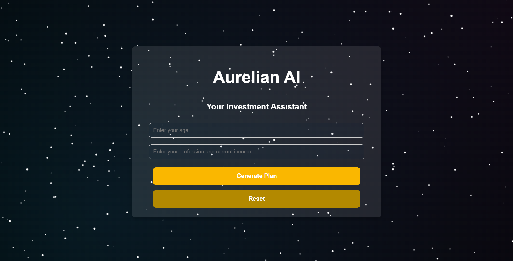

<h1>Solution Challenge 2025</h1>

# 🧠 Aurelian AI – Your Smart Investment Assistant

**Aurelian AI** is a smart investment assistant that suggests personalized investment plans based on your **age** and **profession**. Built using **Flask** and powered by **Google's Gemini API**, it provides an intuitive, AI-driven experience to help users make informed financial decisions.

---

## 🚀 Features

- 🔍 Collects user data via a simple web form (age, profession, income)
- 📊 Returns tailored investment advice using Gemini AI
- ⚡ Lightweight Flask-based web application
- 🌐 Real-time AI interaction via Gemini API
- 🔒 Secure data handling

---

## 🛠️ Tech Stack

- **Frontend**: HTML, CSS (Flask templates)
- **Backend**: Python (Flask)
- **AI Integration**: Gemini API (Google)
- **Others**: REST APIs, Bootstrap (optional)

---

## 🖼️ User Interface

Here's a look at the Aurelian AI web interface:

<p align="center">
  
  <br/>
  <em>Figure: Aurelian AI interface with starry background and clean form layout</em>
</p>

---

## 🧪 How It Works

1. User visits the homepage and enters age, profession, and income.
2. Flask captures the input and sends a prompt to the Gemini API.
3. Gemini responds with a personalized investment plan.
4. Flask renders the suggestions in a clean and readable format.

---

## 💻 Setup Instructions

### 📋 Prerequisites

- Python 3.8+
- Flask
- Gemini API key

### 🔧 Installation

```bash
git clone https://github.com/yourusername/aurelian-ai.git
cd aurelian-ai
pip install -r requirements.txt
